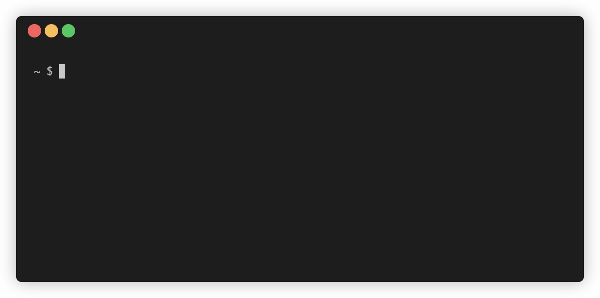

# `grind`



`grind` is an ultra-simple CLI tool to help schedule reviews of LeetCode (or
HackerRank, or Codeforces, etc) practice problems using [spaced
repetition](https://en.wikipedia.org/wiki/Spaced_repetition), a proven method
for effective learning and long-term retention. It is based on the [SuperMemo
2](https://en.wikipedia.org/wiki/SuperMemo) algorithm, a variant of which is
used by the widely popular flashcard app Anki.

I have been slowly building it and using it as my personal tracking tool for
a few months now, and decided to polish it up for others to use. That being
said, it hasn't been well-tested on different OSes and terminals; please feel
free to open issues or PRs if you come across bugs.

## Installation
The easiest way to install `grind` is to open up a terminal of your choice and
copy and paste in the following command:
```sh
curl -s https://raw.githubusercontent.com/brandon-gong/grind/main/install.sh | bash -s
```
This will install `grind` to a hidden folder named `.grind/` in your home
directory, and then update the startup script of your shell (`.bashrc`,
`.zshrc`, or `config.fish`) to add that newly-created folder to your `$PATH` so
you'll be able to run the `grind` command from anywhere. After installing,
restart your terminal for the changes to be recognized.

For more advanced installation, you can `git clone` this repo anywhere you like
(or just download the `grind` script file directly) and add it to your `$PATH`
manually. Typically, `grind` assumes the data it stores is located in the same
directory as itself, but you may customize the location by setting
`$GRIND_DATA_DIR` in your environment.

To completely uninstall `grind`, you simply need to
- Delete the `.grind` folder
- (Optionally) remove the line from your shell's startup script (e.g. `.bashrc`)
	that adds `.grind` to your `$PATH`.

## Usage
Once installed, you can start running `grind` just like this:
```sh
grind
```
This will start a REPL that will present you with old problems to review, or
prompt you to provide a link to a new problem to learn if you're all caught up
with reviewing.

If you just installed `grind`, there won't be any problems in the system yet,
so you'll be faced with the latter case. So go to LeetCode, hit "Pick One",
and paste the link into the prompt!

_Side note: Nothing's stopping you from pasting in a HackerRank or Codeforces
link instead, or something that is not a link at all, but as of now it
cannot include spaces. This is on the TODO list to fix._

Regardless of if it is a new problem or a review, you will be presented with
an opportunity to grade yourself after each question. The grades are as
follows (the prompt will also include this message, so no need to memorize
these):

| grade | meaning                                                   |
|-------|-----------------------------------------------------------|
| 0     | Zero clue how to do it                                    |
| 1     | Didn't solve, but had guesses / vaguely recalled solution |
| 2     | Didn't solve, but had mostly the right idea               |
| 3     | Solved, but took significant effort / many attempts       |
| 4     | Solved, but felt tricky or was not the best solution      |
| 5     | Solved smoothly and easily                                |

Be honest with yourself! Nobody is looking!

Depending on the grade you provide, the problem will be scheduled to be
reviewed after a certain time has passed. The idea is that you do not look
at this problem between now and then; you allow yourself to "forget about it",
so that when you see it again next it gets more firmly planted in your
long-term memory.

Continue your practice session as long as you'd like. You can exit out of
`grind` at any point by hitting <kbd>Ctrl</kbd>+<kbd>C</kbd> or <kbd>Ctrl</kbd>+<kbd>D</kbd> (<kbd>Cmd</kbd> for Mac users). Your data is automatically
saved.

To get an idea of how many problems you've entered into the system and
how many problems are due, you can run

```sh
grind status
```

And if you'd ever like a quick reminder of the commands without having to
come back to this README, just run 

```sh
grind help
```

## Roadmap
I am quite content with where it is at now, and am not looking to turn this
into some giant unmaintainable shell script. However, here are some additional
features that could be implemented:

- [ ] Allow spaces in user input. Need to delimit by something other
      than spaces in the `grind.data` file.
- [ ] Allow users to tag different problems, e.g. `tree`, `dp`, and
      filter/review specific tags only.
- [ ] Allow users to remove problems using the CLI. I could forsee some
      problems getting annoying if the user has seen it too much.
